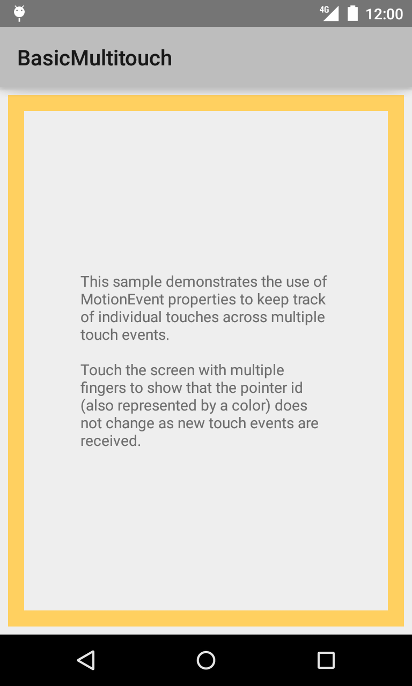
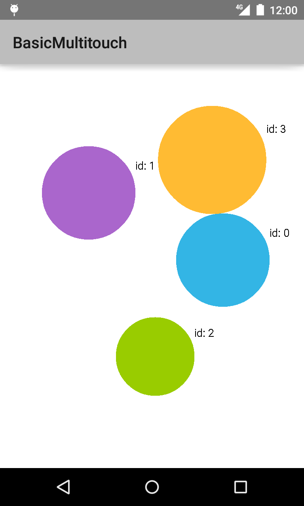

Android BasicMultitouch Sample
===================================

该项目为学习项目，相对于原项目有修改，克隆自https://github.com/googlesamples/android-BasicMultitouch

Sample demonstrates the use of [MotionEvent][1] properties to keep track of
individual touches across multiple touch events.

演示如何使用[MotionEvent][1]追踪多点触控中的每一个触摸。

[1]: http://developer.android.com/reference/android/view/MotionEvent.html

Introduction
------------

This is an example of keeping track of individual touches across multiple
[MotionEvent][1]s.

示例追踪多点触控中的每一个触摸。

This sample uses a custom View (`TouchDisplayView`) that responds to
touch events and draws a colored circle for each touch point. The view holds
data related to a touch pointer, including its current position, pressure,
and its past touch history.

使用自定义的View(`TouchDisplayView`)响应触摸事件，并为每个触摸点绘制带颜色的圆圈。
该view含有与触摸点相关的参数，包括当前位置，压力，及走过的痕迹。

The View draws graphics based on data associated with each touch event to a
canvas. A large circle indicates the current position of a touch, while smaller
trailing circles represent previous positions for that touch.
The size of the large circle is scaled depending on the pressure of the user's
touch.

该View基于与每一个触摸事件相关的画布进行绘制。大圆表示触摸的当前位置，拖尾的小圆表示之前触摸的位置。
大圆的大小根据用户的触摸的力度进行缩放(`不知道是不是这样`)。

[1]: http://developer.android.com/reference/android/view/MotionEvent.html

Pre-requisites
--------------

- Android SDK v21
- Android Build Tools v21.1.1
- Android Support Repository

Screenshots
-------------

 

Getting Started
---------------

This sample uses the Gradle build system. To build this project, use the
"gradlew build" command or use "Import Project" in Android Studio.

该例子使用gradle构建系统。使用"gradlew build"指令或在Android Studio中使用"Import Project"来构建项目。

Support
-------

- Google+ Community: https://plus.google.com/communities/105153134372062985968
- Stack Overflow: http://stackoverflow.com/questions/tagged/android

If you've found an error in this sample, please file an issue:
https://github.com/googlesamples/android-BasicMultitouch

Patches are encouraged, and may be submitted by forking this project and
submitting a pull request through GitHub. Please see CONTRIBUTING.md for more details.

License
-------

Copyright 2014 The Android Open Source Project, Inc.

Licensed to the Apache Software Foundation (ASF) under one or more contributor
license agreements.  See the NOTICE file distributed with this work for
additional information regarding copyright ownership.  The ASF licenses this
file to you under the Apache License, Version 2.0 (the "License"); you may not
use this file except in compliance with the License.  You may obtain a copy of
the License at

http://www.apache.org/licenses/LICENSE-2.0

Unless required by applicable law or agreed to in writing, software
distributed under the License is distributed on an "AS IS" BASIS, WITHOUT
WARRANTIES OR CONDITIONS OF ANY KIND, either express or implied.  See the
License for the specific language governing permissions and limitations under
the License.
